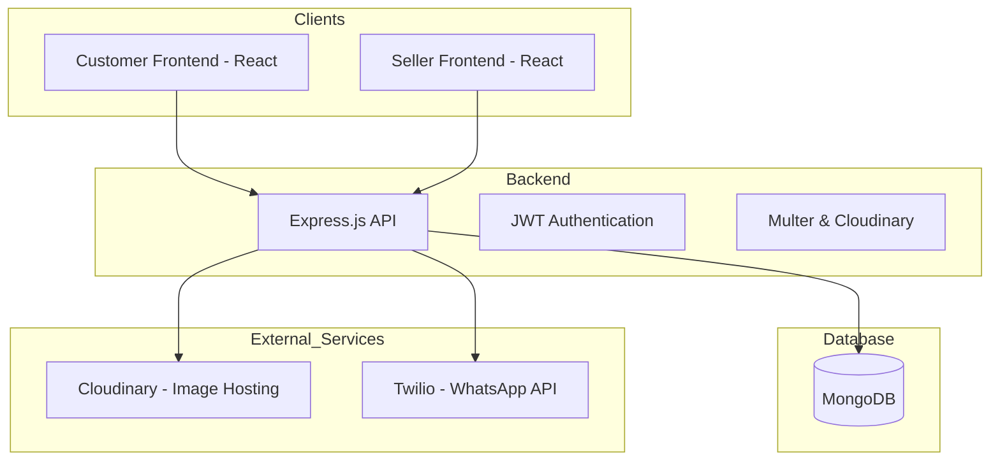

# E-Commerce Platform

A comprehensive full-stack E-Commerce solution featuring a robust **Node.js/Express** backend, a dedicated **Seller Dashboard**, and a **Customer-facing Storefront**. The platform enables sellers to manage products, categories, and orders, while customers can browse unique seller stores via QR codes or slugs.

## 🏗️ Architecture Overview



---

## ✨ Key Features

### 🏢 Seller Dashboard
- **Authentication:** Secure Signup/Login with JWT and Bcrypt hashing.
- **Product Management:** CRUD operations for products with image uploads via Cloudinary.
- **Category Management:** Organize products into custom categories.
- **Order Management:** Real-time order tracking, approval/denial workflow.
- **Customer Insights:** View customer base and interaction history.
- **QR Code System:** Automatically generate QR codes linking directly to the seller's storefront.
- **WhatsApp Integration:** Send bulk notifications/messages to customers using Twilio.
- **Analytics:** Basic dashboard overview of business performance.

### 🛍️ Customer Storefront
- **Storefront via Slug:** Dynamic routing (`/store/:sellerSlug`) allows customers to visit specific seller shops.
- **Shopping Cart:** Context-based cart management for a seamless shopping experience.
- **Order Placement:** Easy checkout process with manual transaction verification.
- **Order Status:** Real-time tracking of order status (Pending → Approved → Paid).
- **Dark Mode:** Responsive UI with theme switching support.

### ⚙️ Backend (API)
- **RESTful Design:** Modular routing and controller structure.
- **Image Processing:** Multer middleware integrated with Cloudinary for efficient storage.
- **QR Generation:** Server-side QR code generation using the `qrcode` library.
- **Validation:** Mongoose schemas with validation and pre-save hooks for security.

---

## 🛠️ Tech Stack

### Backend
- **Runtime:** Node.js
- **Framework:** Express.js
- **Database:** MongoDB (Mongoose ODM)
- **Auth:** JSON Web Token (JWT) & Bcrypt.js
- **Media:** Cloudinary, Multer
- **Messaging:** Twilio (WhatsApp)
- **Utilities:** QRCode, Slugify

### Frontend (Customer & Seller)
- **Framework:** React 19 (TypeScript)
- **Build Tool:** Vite
- **Styling:** Tailwind CSS, PostCSS
- **Icons:** Lucide React, React Icons
- **Routing:** React Router DOM v7
- **State Management:** React Context API

---

## 📁 Project Structure

```text
E-Commerce/
├── backend/                # Express API
│   ├── config/             # DB Configuration
│   ├── controllers/        # Business Logic
│   ├── middleware/         # Auth & Upload Middlewares
│   ├── models/             # Mongoose Schemas
│   ├── routes/             # API Endpoints
│   └── utils/              # Helpers (Cloudinary, Tokens)
├── frontend/
│   ├── frontend_customer/  # Customer React App
│   │   ├── src/components/ # Shared Components
│   │   ├── src/context/    # Cart & Theme Context
│   │   └── src/pages/      # Store, Checkout, Status
│   └── frontend_seller/    # Seller Dashboard App
│       ├── src/components/ # Dashboard Widgets
│       └── src/pages/      # Order Management, QR, Messaging
└── README.md
```

---

## 🚀 Getting Started

### Prerequisites
- Node.js (v18+)
- MongoDB Atlas account or local MongoDB instance
- Cloudinary account (for image uploads)
- Twilio account (optional, for WhatsApp messaging)

### 1. Backend Setup
```bash
cd backend
npm install
```
Create a `.env` file in the `backend/` directory:
```env
PORT=8989
MONGO_URI=your_mongodb_connection_string
JWT_SECRET=your_jwt_secret
CLOUDINARY_CLOUD_NAME=your_cloud_name
CLOUDINARY_API_KEY=your_api_key
CLOUDINARY_API_SECRET=your_api_secret
TWILIO_ACCOUNT_SID=your_sid
TWILIO_AUTH_TOKEN=your_token
TWILIO_WHATSAPP_NUMBER=whatsapp:your_number
```
Start the server:
```bash
npm run dev
```

### 2. Frontend Setup (Seller & Customer)
For both `frontend/frontend_seller` and `frontend/frontend_customer`:
```bash
npm install
npm run dev
```

---

## 📝 Usage Note
- **QR Codes:** Sellers can generate a QR code from their dashboard. This QR code encodes the URL `http://localhost:5173/store/:sellerSlug`.
- **Slugs:** Business names are slugified to create unique URLs for customers.
- **Order Flow:** Customer places order (Pending) -> Seller approves (Approved) -> Customer makes payment/provides transaction ID -> Order marked as Paid.

---

## ⚖️ License
This project is licensed under the **ISC License**.
